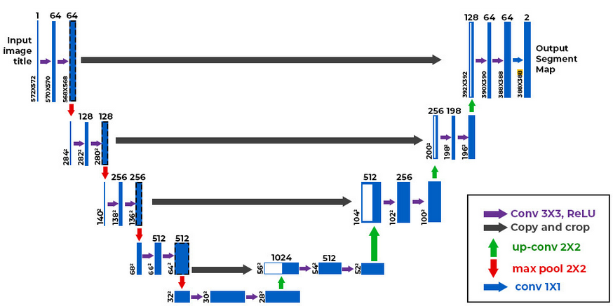
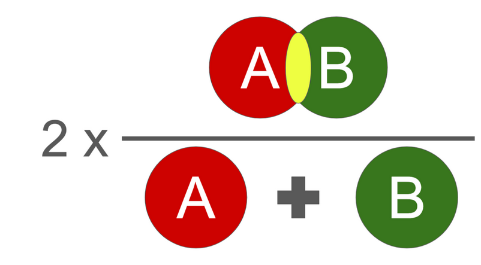
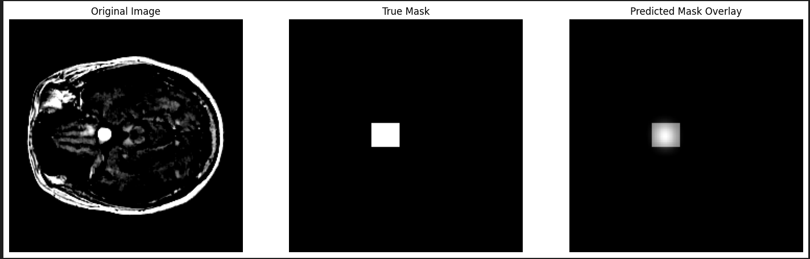

# A Deep Dive into Brain Tumor Segmentation with U-Net Architecture

This project focuses on segmenting brain tumors from medical images using semantic segmentation techniques. The dataset utilized for this project can be found at [Brain Tumor Image Dataset for Semantic Segmentation](https://www.kaggle.com/datasets/pkdarabi/brain-tumor-image-dataset-semantic-segmentation). 

## Table of Contents

- [Description](#description)
- [U-Net Architecture](#u-net-architecture)
  - [Architecture Overview](#architecture-overview)
  - [Benefits of U-Net](#benefits-of-u-net)
- [Dice Loss](#dice-loss)
  - [Issue with Dice Loss in this Project](#issue-with-dice-loss-in-this-project)
- [Evaluation](#evaluation)
- [Installation](#installation)
- [Usage](#usage)
- [Contributing](#contributing)
- [License](#license)
- [Credits](#credits)

## Description

Image segmentation is a crucial task in computer vision that involves partitioning an image into multiple segments to simplify its representation and make it more meaningful for analysis. In medical imaging, segmentation plays a vital role in identifying and delineating specific structures or abnormalities, such as tumors, from images like MRI scans.

### How it Works

Image segmentation algorithms typically operate by assigning each pixel in the image to a specific class or segment. One popular approach for semantic segmentation tasks, such as tumor segmentation, is the use of convolutional neural networks (CNNs). These networks learn to map input images to pixel-wise segmentation masks, which highlight regions of interest.

## U-Net Architecture

U-Net is a convolutional neural network architecture commonly used for biomedical image segmentation tasks. It consists of a contracting path to capture context and a symmetric expanding path for precise localization.

### Architecture Overview

The U-Net architecture comprises an encoder and decoder structure. The encoder downsamples the input image to extract features, while the decoder upsamples the features to generate the final segmentation mask.

### Benefits of U-Net

- U-Net's symmetric architecture helps in preserving spatial information, making it effective for tasks like tumor segmentation.
- Skip connections between corresponding layers in the encoder and decoder facilitate the flow of fine-grained details, aiding in precise localization.

## Dice Loss

Dice Loss is a common loss function used in semantic segmentation tasks, including tumor segmentation. It measures the overlap between the predicted segmentation mask and the ground truth mask. The formula for Dice Loss is given by:

\[ \text{Dice Loss} = 1 - \frac{2 \times \text{Intersection}}{\text{Union}} \]

### Issue with Dice Loss in this Project

The Dice Loss in this project may be inflated due to the size discrepancy between the ground truth masks and the actual tumors. The masks provided in the COCO .json format might be almost twice as big as the actual tumor regions, leading to a higher overlap and consequently, a higher Dice Loss.

## Evaluation

Evaluation of the segmentation results can be done using various metrics, including Dice Coefficient, Intersection over Union (IoU), and Mean Intersection over Union (mIoU). Visual inspection of the segmented images alongside the ground truth can also provide valuable insights into the performance of the model.

---

## Installation

- Clone the repository.
- Install dependencies from `requirements.txt` using pip:

## Usage

- Set up the environment and install dependencies.
- Run the training script to train the DCGAN model.
- Optionally, adjust hyperparameters and configurations as needed.
- You can also use `pip install segmentation-models-pytorch` to install the pretrained models. Here is a link to the documentation: [Segmentation Models PyTorch Documentation](https://segmentation-modelspytorch.readthedocs.io/en/latest/). You can use the backbones provided in the documentation as you wish.

## Contributing

Contributions are welcome! Please reach me out for any possible contributions.

## License

This project is licensed under the MIT License.

## Credits

Acknowledgment of resources, papers, datasets, and tutorials used in the project.

- **U-Net: Convolutional Networks for Biomedical Image Segmentation**  
  - Authors: Olaf Ronneberger, Philipp Fischer, Thomas Brox  
  - Source: [arXiv:1505.04597 [cs.CV]](https://arxiv.org/abs/1505.04597)  
  - Description: This paper introduces the U-Net architecture for biomedical image segmentation, which utilizes a contracting path to capture context and a symmetric expanding path for precise localization. It emphasizes the use of data augmentation to efficiently utilize available annotated samples. The authors demonstrate its effectiveness on various challenges, including segmentation of neuronal structures in electron microscopic stacks and cell tracking in transmitted light microscopy images. The full implementation and trained networks are available [here](https://arxiv.org/abs/1505.04597).

- **U-Net Architecture Explained**  
  - Source: [GeeksforGeeks](https://www.geeksforgeeks.org/u-net-architecture-explained/)  
  - Description: This resource provides an explanation of the U-Net architecture, detailing its components and functionality. It offers insights into how U-Net captures context and enables precise localization in biomedical image segmentation tasks.

- **Brain Tumor Image Dataset for Semantic Segmentation**  
  - Source: [Kaggle](https://www.kaggle.com/datasets/pkdarabi/brain-tumor-image-dataset-semantic-segmentation)  
  - Description: This dataset contains brain tumor images for semantic segmentation tasks. It provides annotated samples for training and evaluation purposes, enabling the development and testing of segmentation algorithms for brain tumor detection and localization.

## Further Information
The format in [text](_annotations.coco.json) is in rectangular format, which makes the brain tumors always be inside of a square box. Hence, the loss might be high. I would highly suggest to take a look at the output of the model. 

As far as it can be observed above, the mask area exceeds the tumor are, but the model has guessed the tumors borders very fine. If you will do any kind of preprocessing, please keep that in mind.
